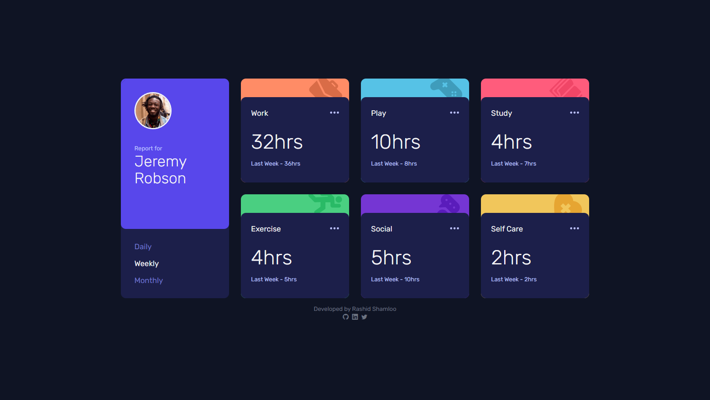
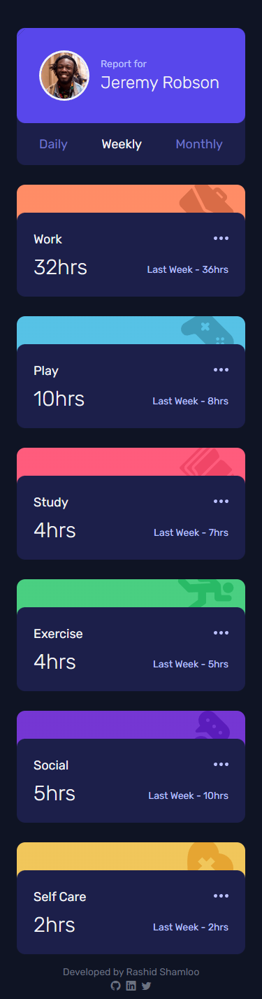

# Front End Mentor - Project 024 - Time Tracking Dashboard

This is a solution to the [Time Tracking Dashboard challenge on Frontend Mentor](https://www.frontendmentor.io/challenges/time-tracking-dashboard-UIQ7167Jw).

## Table of contents

- [Overview](#overview)
  - [Screenshot](#screenshot)
  - [Links](#links)
- [My process](#my-process)
  - [Built with](#built-with)
  - [What I learned](#what-i-learned)
- [Author](#author)

## Overview

### Screenshot

- Desktop

- Mobile

### Links

- Solution URL: https://github.com/rashidshamloo/fem_024_time-tracking-dashboard/
- Live Site URL: https://rashidshamloo.github.io/fem_024_time-tracking-dashboard/

## My process

### Built with

- Vite / React
- Tailwind CSS
- Semantic HTML5 markup

### What I learned

- Setting up and using Tailwind CSS in Vite/React
- Using arbitrary values for classes in Tailwind CSS
- Using breakpoints in Tailwind CSS
- Updating aria-current="page" for navigation links dynamically in React
- Updating the page dynamically based on the data from a JSON file

## Author

- Frontend Mentor - [@rashidshamloo](https://www.frontendmentor.io/profile/rashidshamloo)
- Twitter - [@rashidshamloo](https://www.twitter.com/rashidshamloo)
